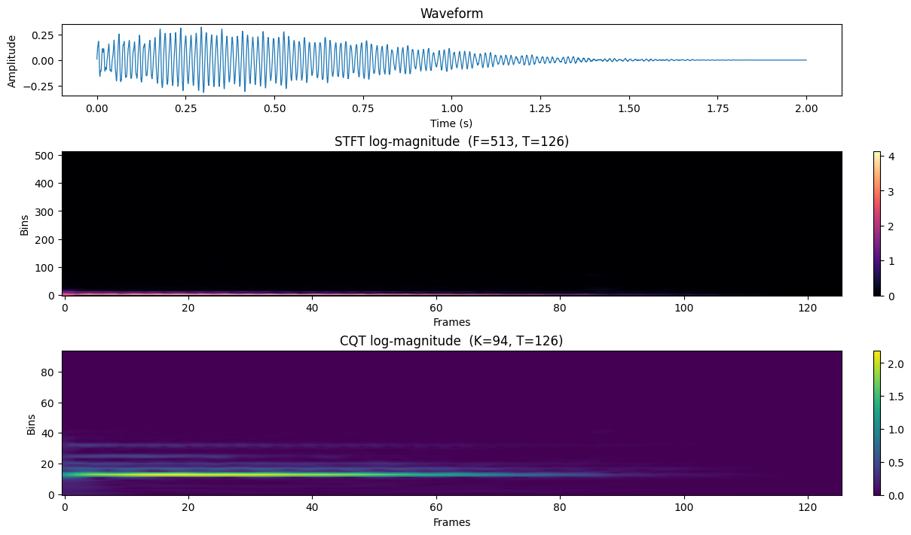
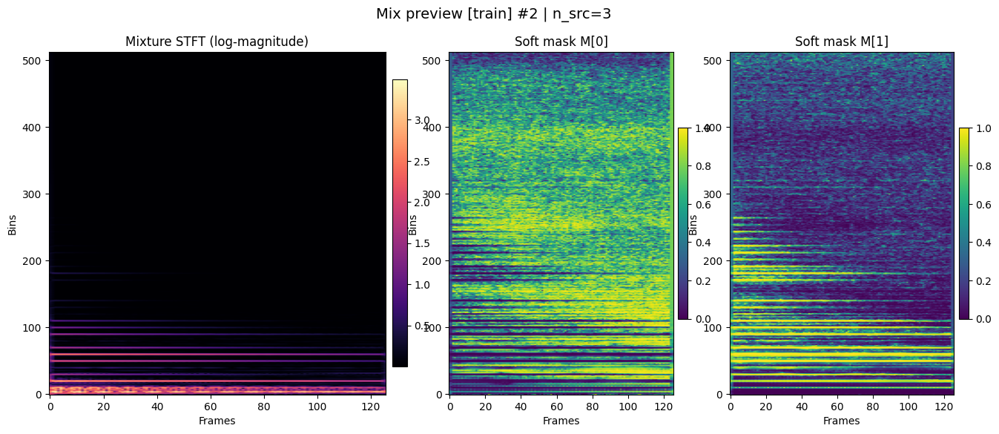
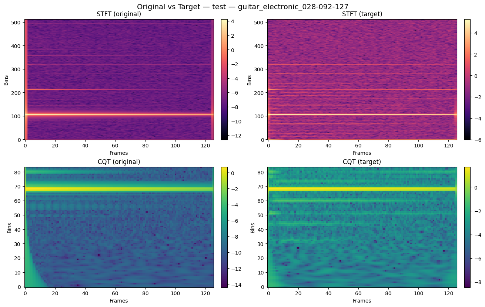
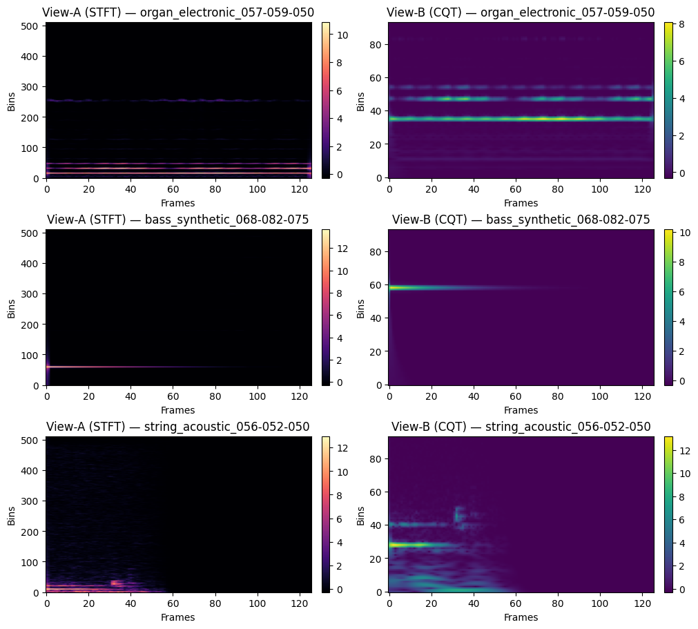
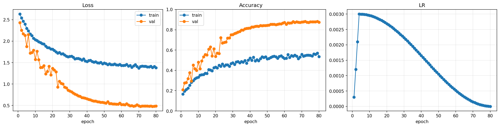
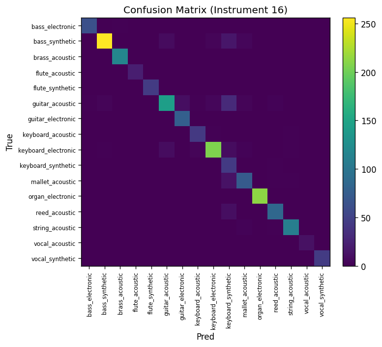
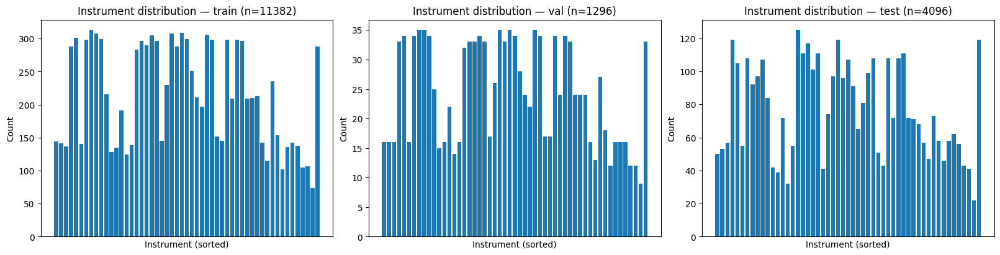

# Multi-View Audio Feature Fusion and Robust Instrument Recognition  
*A Unified Multi-Stage Framework Integrating Multi-View Spectral Analysis, Polyphonic Priors, Domain Robustness, Contrastive Learning, and Multi-Task Representation Modeling*

---

## 1. Introduction

Musical instrument recognition is fundamentally a **timbre modeling problem**, requiring representations that remain discriminative across variations in **pitch**, **intensity**, **articulation**, and **acoustic domain**. Conventional STFT/MFCC pipelines often fail when:

- harmonic and temporal cues conflict,
- noise and reverberation distort the spectrum,
- instruments with similar envelopes overlap,
- representation is limited to a single view.

To address these issues, this project develops a complete **multi-view, multi-domain, and multi-task learning system** based on:

1. Multi-view time–frequency features (STFT + CQT)  
2. Polyphonic synthetic mixtures and soft mask priors  
3. Domain degradation for acoustic robustness  
4. Contrastive self-supervision for view alignment  
5. Multi-task supervised learning for rich semantic structure  
6. Multi-view visualization tools for interpretability  

This architecture is grounded in signal processing, source separation theory, and self-supervised representation learning.

---

# 2. System Overview

The pipeline is organized according to the hypothesis that:

> **Robust instrument recognition requires representations that are multi-view aligned, domain-invariant, and semantically structured.**

The complete flow:

1. Multi-view spectral features  
2. Polyphonic mixture generation  
3. Domain degradation  
4. Contrastive SSL  
5. Multi-task supervised learning  
6. Visualization & diagnostics  

Each step enhances the next, forming a tightly integrated timbre modeling system rather than isolated stages.

---

# 3. Multi-View Time–Frequency Representations

## 3.1 Motivation

**STFT** contributes:

- transient and temporal detail  
- broadband frequency content  

**CQT** contributes:

- musically aligned log-frequency bins  
- stable harmonic spacing  
- stronger pitch invariance  

Together they approximate orthogonal components of timbre.

## 3.2 Implementation

- STFT: 1024 Hann window, hop 256  
- CQT: 96 bins per octave, log-magnitude  
- Standardization: global mean/variance  
- Caching for ~10× faster training  

## 3.3 Integration with Later Stages

- paired views enable contrastive alignment  
- STFT supports polyphonic soft masks  
- Δ-view comparisons for domain consistency  
- enhanced harmonic cues for multi-task labels  

## 3.4 Visualization

---

# 4. Polyphonic Mixture Synthesis and Soft Mask Priors

## 4.1 Motivation from Source Separation Theory

To simulate real-world polyphony, we synthesize mixtures and compute **ideal ratio masks**:

$$
M_k(f,t) = \frac{|S_k(f,t)|}{\sum_j |S_j(f,t)| + \epsilon}.
$$

This describes the fractional contribution of each source at every time–frequency bin.

## 4.2 Implementation Steps

- Select 2–3 monophonic notes  
- Mix waveforms in time domain  
- Compute STFT for each source and mixture  
- Derive soft masks  
- Store as `.npz`  

## 4.3 Why It Helps

Soft masks encode:

- harmonic dominance  
- partial overlaps  
- transient interaction patterns  

strengthening structural invariances learned by the backbone.

## 4.4 Visualization

---

# 5. Target-Domain Degradation  
Modeling Real Acoustic Variability

## 5.1 Motivation

Real acoustic environments differ from NSynth's clean studio recordings.  
We simulate paired degraded samples:

$$
x_\text{target} = T(x_\text{original}),
$$

where \(T(\cdot)\) models real-world distortions.

## 5.2 Types of Degradations

| Category | Description |
|---------|-------------|
| Reverb | BRIR/HRIR convolution, RT60 0.2–1.2 s |
| Noise  | 10–20 dB SNR (pink/white noise) |
| EQ     | Low/high shelving filters |
| Codec  | MP3/OPUS (24–48 kbps) |

## 5.3 Role in the Model

- improves domain robustness  
- stabilizes spectral–temporal cues  
- encourages domain-invariant latent space  

## 5.4 Visualizations

  

---

# 6. Contrastive Multi-View Self-Supervised Learning (SSL)

## 6.1 Theory

SSL enforces alignment between the two views:

$$
z_{\text{STFT}} \approx z_{\text{CQT}},
$$

while separating different instruments via NT-Xent loss.

Benefits:

- view invariance  
- domain stability  
- improved clustering of timbre  

## 6.2 Implementation

- NT-Xent loss  
- temperature scheduling  
- positive pair: (STFT, CQT) of the same sample  
- negatives: other samples in the batch  

## 6.3 SSL Training Behavior

---

# 7. Supervised Multi-Task Learning (MTL)

## 7.1 Motivation

Timbre depends on:

- instrument family  
- spectral envelope  
- pitch class  
- velocity  
- transient richness  

Thus, recognition is formulated as multi-task prediction to enforce a factorized internal representation.

## 7.2 Architecture

- Shared backbone: CRNN or Conformer  
- Prediction heads:
  - 16-class instrument classifier  
  - 8-class family classifier  
  - 12-class pitch-class classifier  
  - 3–5-class velocity-bin classifier  
  - 5-D timbre attribute regressor (SC/SS/SF/ZCR/HBR)  

## 7.3 Interaction with SSL & Multi-View Learning

- SSL provides a stable aligned space  
- domain degradation improves robustness  
- polyphonic mixtures regularize harmonic encoding  
- MTL embeds semantic structure into the latent representation  

## 7.4 Performance Curves

---

# 8. Multi-View Visualization & Diagnostics

Provides tools for:

- cross-domain consistency checks  
- view alignment inspection  
- harmonic-based interpretability  

Example:

---

# 9. Final Performance Summary

- ~90% accuracy on NSynth-16  
- strong robustness under RT60 0.2–1.2 s reverberation  
- stable performance at 10–20 dB SNR  
- reduced confusion among harmonically similar instruments  
- monotonic convergence during SSL and supervised training  

---

# 10. Conclusion

This project presents a unified timbre-learning framework combining:

- multi-view spectral representation  
- polyphonic priors  
- domain robustness  
- contrastive multi-view SSL  
- multi-task learning  
- visualization diagnostics  

Together these modules form a **holistic, interpretable, and robust** instrument recognition system capable of handling real-world acoustic challenges.

