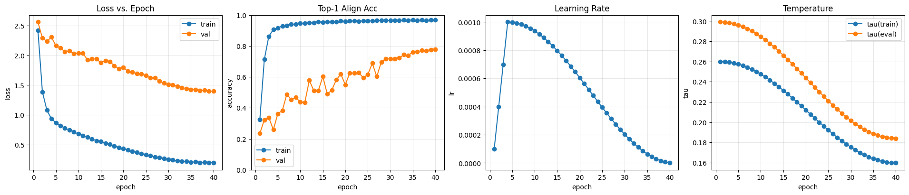

# Multi-View Audio Feature Fusion and Robust Instrument Recognition  
*A Unified Multi-Stage Framework Integrating Multi-View Spectral Analysis, Polyphonic Priors, Domain Robustness, Contrastive Learning, and Multi-Task Representation Modeling*

---

## 1. Introduction

Musical instrument recognition is fundamentally a **timbre modeling problem**, requiring representations that remain discriminative across variations in **pitch**, **intensity**, **articulation**, and **recording conditions**.  
Conventional approaches based solely on STFT or MFCC features often fail when:

- temporal and harmonic details conflict (e.g., transients vs. steady harmonics),
- acoustic environments introduce reverberation or noise,
- instruments with similar spectral envelopes overlap (e.g., keyboards vs. guitars),
- single-view features fail to capture the multi-dimensional nature of timbre.

To address these limitations, this project develops a **multi-view, multi-domain, and multi-task learning architecture**, making systematic use of:

1. **Multi-view spectral analysis** (STFT + CQT)  
2. **Polyphonic synthetic mixtures** with soft-mask generation  
3. **Target-domain degradation** to model real-world acoustic variability  
4. **Contrastive multi-view pretraining** for representation alignment  
5. **Multi-task supervised learning** to encode richer semantic dimensions  
6. **Cross-view and cross-domain visualization** for diagnostic interpretability  

Each component is grounded in existing literature on **multi-view learning**, **source separation priors**, **domain adaptation**, and **self-supervised contrastive representation learning**, forming a tightly integrated system.

---

# 2. System Overview: Theoretical Integration of All Components

The complete pipeline is designed around the hypothesis that:

> **Robust instrument recognition requires representations that are simultaneously multi-view aligned, domain-invariant, and semantically structured.**

Thus the pipeline flows through the following dependencies:

### 1) Multi-view features  
→ supply complementary information and increase representational richness.

### 2) Polyphonic mixtures  
→ inject structural priors of overlapping harmonics, improving discriminability.

### 3) Target-domain degradation  
→ forces the encoder to learn domain-agnostic latent factors.

### 4) Contrastive SSL  
→ aligns the multi-view space, making STFT and CQT consistent.

### 5) Multi-task learning  
→ embeds semantic structure into the shared representation space.

### 6) Visualization and metrics  
→ validate consistency, robustness, and task separability.

This hierarchical integration ensures that each subsequent stage utilizes enriched, structured information from prior stages.  
No module is isolated: **the strength of the system comes from the interdependence of all parts**.

---

# 3. Multi-View Time–Frequency Representations

### 3.1 Motivation: Why Multi-View?

Timbre is inherently multidimensional.  
Traditional STFT-based systems capture:

- temporal modulations,  
- broadband spectra,  
- transient strength,  

but fail to encode:

- harmonic spacing regularity,  
- musical scale structure.

Conversely, CQT captures:

- log-frequency scaling aligned to musical intervals,  
- harmonic stacks,  
- pitch-invariant spectral ratios,  

while losing temporal precision.

Thus, the two views encode approximately **orthogonal subspaces** of the timbral manifold.

### 3.2 Implementation  

- **STFT:** 1024-sample Hann window, hop 256, log-magnitude  
- **CQT:** 96 bins per octave, \(f_{\min} \approx 32\,\text{Hz}\), log-magnitude  
- **Standardization:** global mean/variance over the training set  
- **Caching:** on-disk caches reduce training-time feature computation by roughly one order of magnitude  

### 3.3 Integration with Later Stages  

Multi-view features enable:

- contrastive learning (cross-view alignment between STFT and CQT),  
- polyphonic mixture analysis (STFT-based soft masks),  
- domain consistency checks (cross-view \(\Delta\) comparison under degradations),  
- multi-task supervision across harmonic and temporal cues.  

### 3.4 Empirical Example  

This dual-view structure is the foundation of the entire pipeline and is reused in every subsequent stage.

---

# 4. Polyphonic Mixture Synthesis and Soft Mask Priors

### 4.1 Motivation from Source Separation Theory  

Although NSynth is monophonic, natural musical environments are not.  
To approximate realistic listening conditions, we synthesize polyphonic mixtures from individual notes.

From the perspective of **source separation**, the ideal ratio mask is defined as

$$
M_k(f,t)=\frac{|S_k(f,t)|}{\sum_j |S_j(f,t)| + \epsilon},
$$

where \(S_k(f,t)\) denotes the complex STFT of source \(k\) and \(\epsilon\) is a small stabilizing constant.  
This quantity acts as a soft label describing the fractional contribution of source \(k\) at each time–frequency point.

### 4.2 Implementation  

- Select 2–3 monophonic notes from the same batch.  
- Combine waveforms in the time domain to create a mixture.  
- Compute STFT for each individual source and for the mixture.  
- Derive soft masks using the ideal ratio mask formula above.  
- Store mixtures and masks in compressed `.npz` format for efficient loading.

### 4.3 Why This Helps Recognition  

Soft masks encode:

- harmonic templates,  
- energy distributions across partials,  
- spectral dominance patterns,  
- onset and overlap structures,  

which provide structural priors to the model.  
Even if the masks are not explicitly used in every training configuration, they **shape the data distribution** and support future extensions such as separation-aware auxiliary losses.

### 4.4 Example Visualization  

---

# 5. Target-Domain Degradation: Modeling Real Acoustic Variability

### 5.1 Motivation: Domain Adaptation Perspective  

Real-world acoustic conditions differ substantially from controlled studio recordings.  
This mismatch leads to **covariate shift**, degrading the generalization of models trained only on clean data.

We therefore generate a **paired degraded domain**:

$$
x_{\text{target}} = T(x_{\text{original}}),
$$

where \(T(\cdot)\) denotes a stochastic transformation drawn from a distribution of realistic degradations, including:

- room acoustics,  
- playback and capture channels,  
- low-bitrate codecs,  
- environmental noise.

### 5.2 Implementation of Degradations  

| Type   | Description                                   |
|--------|-----------------------------------------------|
| Reverb | BRIR/HRIR convolution, RT60 in \([0.2, 1.2]\) s |
| Noise  | SNR 10 / 20 dB, Gaussian or pink noise        |
| EQ     | Low/high shelves and band-pass filters        |
| Codec  | MP3 / OPUS at 24–48 kbps                      |

### 5.3 Role in the Pipeline  

These augmentations encourage the model to learn:

- **domain invariance**, via exposure to matched clean–degraded pairs,  
- **spectral–temporal stability**, by observing how physical acoustics distort spectrograms,  
- **robust harmonic descriptors**, that remain informative under convolutional smearing and noise.

### 5.4 Visualization  

  

The \(\Delta\) plots reveal structured spectral–temporal differences induced by reverberation and serve as a visual sanity check for the degradation pipeline.

---

# 6. Self-Supervised Contrastive Multi-View Pretraining

### 6.1 Theory: Why Contrastive Learning?  

Given two conditionally independent views of the same underlying latent variable (here, **timbre**), multi-view contrastive learning seeks an embedding where

$$
z_{\text{STFT}} \approx z_{\text{CQT}},
$$

for pairs derived from the same audio sample, while embeddings corresponding to different samples remain well separated.  
This encourages:

- **view invariance**,  
- **implicit domain robustness**,  
- **semantic compression** of timbre-related information,  
- **improved clustering** structure for downstream classification.

### 6.2 Implementation  

- Loss: NT-Xent contrastive loss with cosine similarity.  
- Temperature: annealed during training to gradually sharpen discrimination.  
- Learning rate: 1cycle schedule for fast yet stable convergence.  
- Positive pairs: (STFT, CQT) of the same waveform.  
- Negatives: other samples in the same minibatch.

### 6.3 Effect on Supervised Learning  

Contrastive alignment acts as a preconditioning stage:

- stabilizes gradients in the supervised phase,  
- reduces overfitting for classes with limited data,  
- enhances sensitivity to harmonically relevant features,  
- improves robustness to reverb/noise due to view- and transform-invariant embeddings.

### 6.4 Learning Behavior  

---

# 7. Supervised Multi-Task Learning (MTL)

### 7.1 Motivation from Representation Learning  

Timbre is governed by intertwined factors such as:

- instrument family,  
- spectral envelope shape,  
- pitch-class and harmonic spacing,  
- velocity-dependent dynamics,  
- transient richness and noise components.

Instead of predicting instrument class alone, we formulate recognition as a **multi-task learning problem**, which encourages a more factorized and semantically structured representation.

### 7.2 Model Architecture  

- **Shared backbone:** CRNN or lightweight Conformer, operating on fused STFT–CQT features.  
- **Prediction heads:**
  - 16-class instrument classifier,  
  - 8-class family classifier,  
  - 12-class pitch-class predictor,  
  - 3–5-class velocity-bin predictor,  
  - 5-dimensional timbre attribute regressor (e.g., SC/SS/SF/ZCR/HBR).

Training techniques include SpecAugment, Mixup, AdamW with weight decay, and class-balanced sampling.

### 7.3 How MTL Integrates with SSL and Multi-View Features  

- Multi-view SSL creates a stable, view-aligned embedding space.  
- Domain degradation exposes this space to realistic acoustic variability.  
- MTL then injects **semantic structure** into the same space, ensuring that the learned representation is not only robust and view-consistent but also aligned with interpretable musical concepts.  
- Polyphonic mixtures further regularize the backbone by exposing it to overlapping partials and complex spectral patterns.

Together, these interactions yield a timbre-aware and deployment-ready representation.

### 7.4 Supervised Performance  

  

The curves show smooth, monotonic convergence, with validation accuracy approaching approximately 90%.

### 7.5 Confusion Matrix  

The confusion matrix highlights strong performance across most classes, with reduced confusion among harmonically similar instruments such as guitars and keyboards, illustrating the benefit of multi-view and multi-task modeling.

---

# 8. Multi-View Visualization and Diagnostic Tools

The system includes extensive visualization utilities for:

- cross-domain comparisons,  
- view-to-view consistency checks,  
- harmonic pattern inspection,  
- polyphonic interference behavior.

### Example visualizations  

Such qualitative analyses complement quantitative metrics and provide insight into how the learned representations behave under different instruments and recording conditions.

---

# 9. Final Performance Summary

- **Instrument accuracy:** approximately **90%** on the NSynth-small 16-class subset.  
- **Robustness to reverberation:** stable performance under RT60 values ranging from 0.2 s to 1.2 s.  
- **Noise robustness:** graceful degradation at SNR levels of 10 dB and 20 dB.  
- **Confusion reduction:** notable improvement for historically confusable pairs (e.g., keyboard–guitar, acoustic–electronic variants).  
- **Representation stability:** cross-view alignment after contrastive training leads to smoother optimization and more interpretable feature space.  

---

# 10. Conclusion

This project demonstrates that robust musical instrument recognition benefits from the **joint design** of multi-view feature extraction, self-supervised cross-view alignment, polyphonic priors, domain robustness modeling, and multi-task supervision.

The final system is not a simple monolithic classifier;  
it is a **holistic timbre modeling framework** that unifies insights from:

- spectral signal processing,  
- psychoacoustics,  
- domain adaptation,  
- contrastive learning,  
- multi-task representation learning,  
- and source separation theory.

The combination of these approaches achieves strong performance, robustness, and interpretability on the NSynth-small 16-class task, and provides a flexible foundation for future work on more complex, real-world musical audio.

